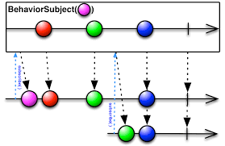
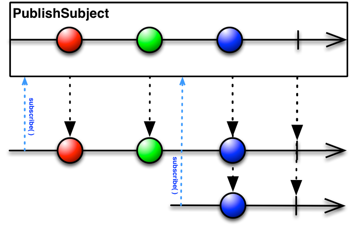
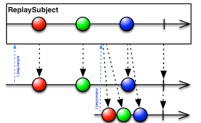

### Observable

+ 데이터의 변화가 발생하는 데이터 소스.
+ 리액티브 프로그래밍의 기초.
+ 라이프사이클 존재하지 않음.
+ 옵저버 패턴 구현
  1. 객체의 상태 변화를 관찰하는 관찰자(옵저버) 목록을 객체에 등록
  2. 상태 변화가 있을 때마다 메서드를 호출하여 객체가 직접 목록의 옵저버에게 변화를 알림.

+ ##### Observed가 관찰을 통해 얻은 결과라면, Observable은 앞으로 관찰할 가능성을 의미한다.

+   Observable의 알림
+ + onNext : Observable이 데이터의 발행을 알림.
  + onComplete : 모든 데이터의 발행을 완료했음을 알림. 단 한번만 발생. 이후 onNext가 발생하지 않음.
  + onError : 어떤 이유로 에러가 발생함을 알림. 이후 Observable의 실행을 바로 종료함.
+ Observable의 팩토리 함수

| 버전                      | 팩토리 함수                                                  |
| ------------------------- | ------------------------------------------------------------ |
| RxJava 1.x                | create(), just(), from()                                     |
| RxJava 2.x(from() 세분화) | fromArray(), fromIterable(), fromCallable(), fromFuture(), frompublisher() |
| 기타                      | interval(), range(), timer(), defer() 등                     |

### Flowable

+ Observable + backpressure buffer(backpressure 이슈 대응.)
+ + backpressure(배압)?
  + 생산자의 생성속도(element 생성)가 소비자의 소비속도(element를 꺼내감)보다 빠르면, 언젠가 OutOfMemoryException이 발생할 수 있음.

### Disposable

+ void dispose()
  + 데이터 발행을 종료하도록 구독 해지
+ boolean isDisposed()
  + 구독이 해지되었는지(데이터를 더 이상 발행하지 않는지) 확인

### Single

+ Observable의 특수한 형태. Observable에서 변환
+ 데이터를 오로지 하나만 발행함.
+ onNext, onComplete, onError가 있던 Observable에 반해, Single클래스는 onNext와 onComplete를 통합한onSuccess, onError만 존재.
+ Observable에서 변환하는 방법

```java
// 앞에서 공부한 Observable을 Single 객체로 변환하기
Observable<String> observable = Observable.just("Single");
Single.fromObservable(observable)
	.subscribe(System.out::println); //출력결과 : Single

// single()함수를 통해 Single 객체 생성하기
Observable.just("Single")
  .single("default")
  .subscribe(System.out::println); // 출력결과 : Single

// first()함수를 통해 Single 객체 생성하기
String[] color = {"Red", "Blue", "Gold"};
Observable.fromArray(color)
  .first("default1")
  .subscribe(System.out::println); // 출력결과 : Red

// empty Observable에서 Single객체 생성하기
Observable.empty()
  .single("default2")
  .subscribe(System.out::println); // 출력결과 : default2

// take()함수에서 Single객체 생성하기
Observable.just("string1", "string2")
  .take(1)
  .single("default")
  .subscribe(System.out::println); // 출력결과 : string1
```

### Maybe

+ Single + onComplete.
+ 데이터를 발행하지 않거나, 하나만 발행한다.

### Subject

+ 차가운 Observable을 뜨거운 Observable로 변환.

+ Subject Sub Class

+ + ##### AsyncSubject

  + + onComplete() 직전에 발행한 데이터만 발행하고 종료.


+ + ##### BehaviorSubject

  + + 구독하면 가장 최근값과, 이후 발행되는 데이터를 발행.



+ + ##### PublishSubject

  + + 구독 이후 발행하는 데이터를 발행함.



+ + ##### ReplaySubject

  + + 차가운 Observable처럼 동작함
    + 데이터의 처음부터 끝까지 발행하는 것을 보장
    + 마치, 테이프로 녹음해두고, 구독자가 오면 처음부터 재생하는 것과 같음
    + 메모리 누수 가능성을 염두해야함

