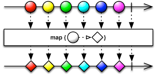
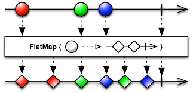
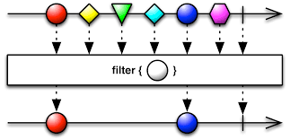

# 리액티브 연산자

### 리액티브 연산자 종류

+ 생성(Creating) 연산자
+ 변환(Transforming) 연산자
+ 필터(Filter) 연산자
+ 합성(Combining) 연산자
+ 오류 처리(Error Handling) 연산자
+ 조건(Conditional) 연산자
+ 수학과 집합형 연산자
+ 배압(Back pressure) 연산자

----------

### map()

+ 입력값을 어떤 함수에 넣어서 원하는 값으로 변환.
+ 다른 객체로 변환할 수도 있음.

### flatMap()

+ map()함수를 좀 더 발전시킨 함수.
+ map()함수는 입력값과 변환값이 1:1
+ 이 함수는 결과가 Observable로 반환. -> 1:多

### filter()

+ Observable에서 원하는 데이터만 걸러내는 역할

