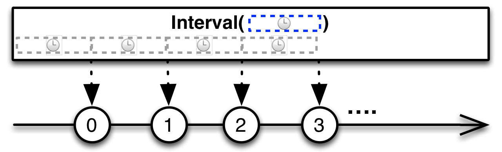

# 리액티브 연산자

### 리액티브 연산자 종류

+ 생성(Creating) 연산자
+ 변환(Transforming) 연산자
+ 필터(Filter) 연산자
+ 합성(Combining) 연산자
+ 오류 처리(Error Handling) 연산자
+ 조건(Conditional) 연산자
+ 수학과 집합형 연산자
+ 배압(Back pressure) 연산자

----------

### map() (변환연산자)

+ 입력값을 어떤 함수에 넣어서 원하는 값으로 변환.
+ 다른 객체로 변환할 수도 있음.


### flatMap() (변환연산자)

+ map()함수를 좀 더 발전시킨 함수.
+ map()함수는 입력값과 변환값이 1:1
+ 이 함수는 결과가 Observable로 반환. -> 1:多


filter() (필터연산자)

+ Observable에서 원하는 데이터만 걸러내는 역할


##### 비슷한 함수들

+ first(default) : Observable의 첫 번째값을 반환. 값이 없으면 기본값.
+ last(default) : Observable의 마지막값을 반환. 값이 없으면 기본값.
+ take(N) : 최초부터 N개의 값만 가져옴.
+ takeLast(N) : 마지막부터 N개 값을 가져옴.
+ skip(N) : 최초부터 N개 값을 건너뜀.
+ skipLast(N) : 마지막부터 N개 값을 건너뜀.

### reduce() (기타 연산자)

+ 최종 결과 데이터를 합성할 때 활용.
+ Observable이 아닌 Maybe를 반환한다.


## 생성 연산자

### interval()

+ 일정 시간 간격으로 데이터 흐름을 생성함.
+ 함수 원형

```java
@SchdulerSupport(SchedulerSupport.COMPUTATION)
public static Observable<Long> interval(long period, TimeUnit unit)
public static Observable<Long> interval(long init, long period, TimeUnit unit)
```

+ 첫 번째는 일정시간을 쉰 후 데이터를 발행.
+ 두 번째는 최초 지연 시간을 추가로 조절할 수 있음.
+ 함수가 계산 스케쥴러에 의해 실행됨. => 별도의 스레드에서 동작.



### timer()

+ interval() 과 유사하지만, 한 번만 실행하는 함수.
+ 일정 시간이 지난 후, 한 개의 데이터를 발행하고 onComplete() 발생.


### range()

+ 주어진 값 n부터 m개의 Integer 객체를 발행.
+ 현재 스레드에서 실행.


### intervalRange()

+ interval() + range()
+ 일정한 시간 간격으로 값을 발행하지만, 일정 개수만큼만 발행한다.
+ Long 반환.
+ 매개변수는 range()의 매개변수 interval()의 매개변수.


### defer()

+ timer()와 비슷
+ 데이터 흐름생성을 구독자가 subscribe() 할 때 까지 미룸.
+ 현제 스레드에서 실행됨.


## 변환 연산자

### concatMap()

+ flatMap()과 비슷.
+ flatMap()은 데이터 처리 중 다른 데이터가 선점할 수 있음.
+ concatMap()은 데이터가 들어온 순서대로 처리하는 것이 보장됨.
+ flatMap()에 비해 속도가 떨어짐.


### switchMap()

+ concatMap()과 다르게, 순서를 보장하기 위해 기존에 진행중이던 작업을 중지.

